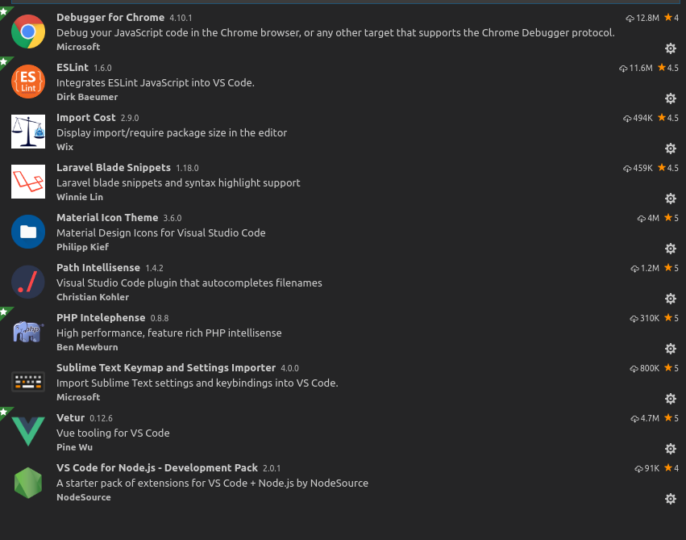

### Visual Studio Code Configuration for Mac with Extension
<p>
<h4 style="color:#ff9999; font-size:20; font-weigth:bold;"> &#9758;&nbsp;&nbsp;&nbsp; How to configure vscode? </h4>
</p>

```bash
cd /Users/rajendrayadav/Library/Application Support/Code/User
git clone https://github.com/rajendrakumaryadav/vscodeconfig_mac.git
```
<p>
<h4 style="color:#ff9999; font-size:20; font-weight:bold;"> &#9758;&nbsp;&nbsp;&nbsp; Used Extension with the configuration</h4>
<div style="color: orange;font-size:18; font-weight: bold;">
    <span> I used to write code for Web Application in Visual Studio Code, So Configuration are related to <em>Laravel, vue-js, vue-html, react, javascript, typescript, css, scss, blade templating .</em> </span>
</div>
</p>
<h4 style="color:#ff9999; font-size:20; font-weigth:bold;"> &#9758;&nbsp;&nbsp;&nbsp; Image Screenshot installed extension in my machine</h4>

<p>
    
</p>

<h2 style="color: gray; text-align:center;">  
:ok_hand: 
:sparkles: 
:bulb: Happy Coding... :bulb: Keep Coding... :sparkles:  :sunflower: :sunflower: :rose: :rose:</h2>